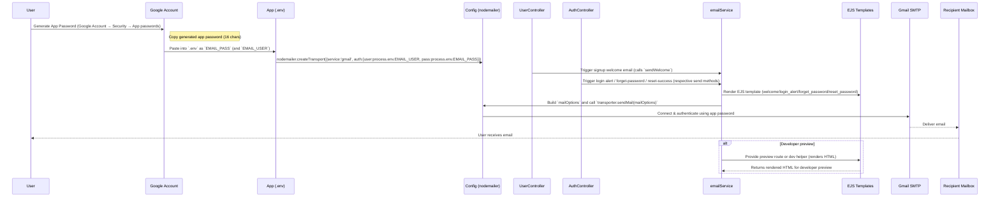

## Email Delivery Flow — Sequence Diagram

The diagram below tracks the full email delivery flow: generating a Gmail App Password, storing credentials, transporter setup, controllers that trigger email sends (signup welcome, login alert, forget-password/reset, reset success), rendering EJS templates, and delivery via Gmail SMTP. Preview using VS Code's Markdown preview or the Mermaid Live Editor to verify rendering.

Preview tips:

- Use VS Code: open this file and run "Open Preview" (Ctrl+Shift+V) or install a Mermaid preview extension.
- Or paste the Mermaid block into https://mermaid.live to validate and render.

Notes:

- Ensure `EMAIL_USER` and `EMAIL_PASS` are set in `.env` and not committed to source control.
- For Gmail, enable 2FA and create an App Password for SMTP usage.
